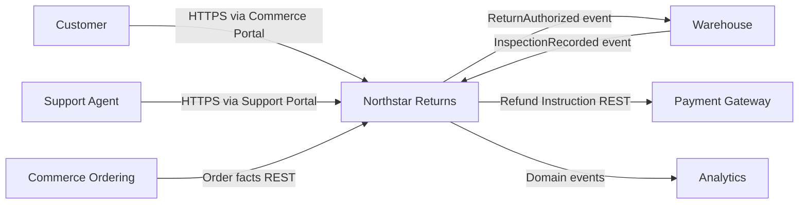
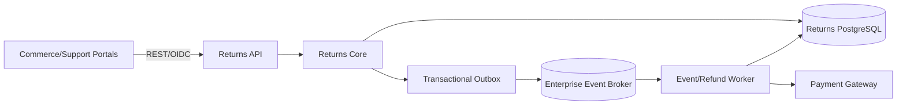
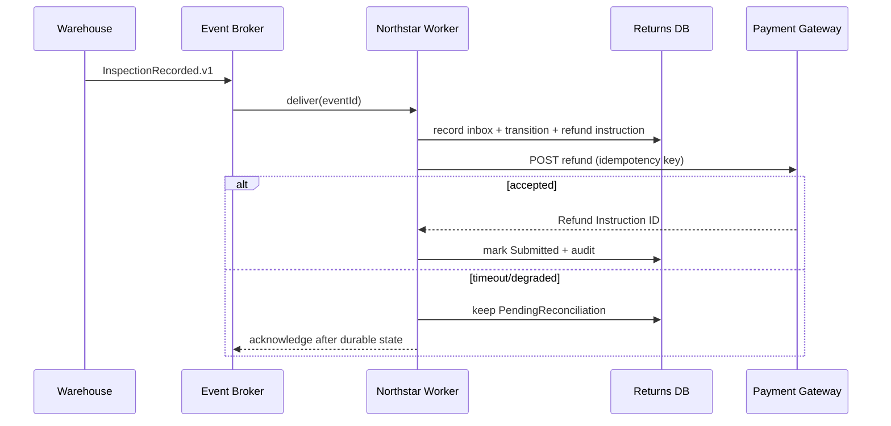
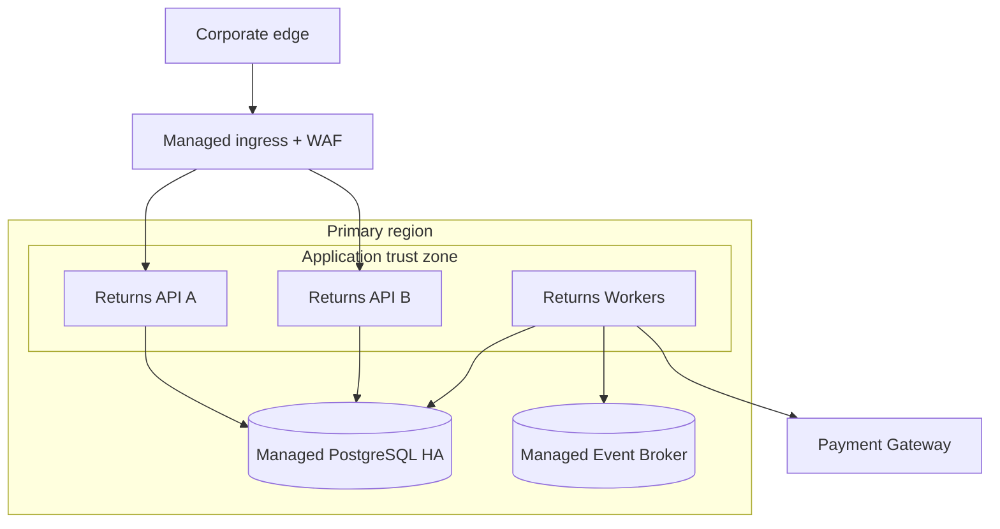

<!--
Fictional sample based on the reusable skill template and the five-view pattern
from Bertrand Florat's Architecture Document Template:
https://github.com/bflorat/architecture-document-template
Sample/template adaptation licensed CC BY-SA 4.0:
https://creativecommons.org/licenses/by-sa/4.0/
No endorsement by the creator is implied; see the upstream source for the
original work, notices, history, and disclaimers.
-->

# Northstar Returns Technical Architecture Document

## Document control

| Field | Value |
|---|---|
| Status | Example — approved target architecture |
| Owner | Commerce Architecture |
| Last updated | 2026-07-16 |
| Source revision | Fictional sample `sample-2026-07` |
| Review cadence | Quarterly and after any material integration or SLO change |
| Classification | Internal |

## Executive summary

Northstar Returns manages return eligibility, Return Authorizations, warehouse inspection outcomes, and Refund Instructions for the Commerce domain. It exposes a synchronous API to the Commerce Portal and publishes durable events for the Warehouse and Finance domains. The target is a stateless API plus asynchronous workers on the managed container platform, PostgreSQL as the system of record, and the organization event broker for integration.

Availability and auditability outrank raw throughput. The API targets 99.9% monthly availability and p95 latency below 300 ms at the forecast peak. Accepted Return Authorizations must survive a regional application restart; PostgreSQL recovery targets are RPO <= 5 minutes and RTO <= 30 minutes. Principal risks are the Payment Gateway's variable refund latency and incomplete load evidence for the seasonal 4x burst.

## Purpose, audience, and scope

This document supports implementation, production readiness, security review, capacity planning, and operational ownership.

**In scope**

- eligibility evaluation for delivered orders;
- lifecycle of Return Authorizations;
- warehouse inspection outcomes;
- creation and tracking of Refund Instructions;
- production architecture and transition from the legacy returns module.

**Out of scope**

- original order fulfillment, owned by Commerce Ordering;
- physical parcel transport, owned by Logistics;
- refund settlement internals, owned by Payments;
- environment-specific addresses and credentials, held in deployment configuration and the secrets manager.

| Stakeholder | Concern answered here |
|---|---|
| Returns Product Owner | Capability boundary, lifecycle, and transition |
| Commerce developers | APIs, events, data ownership, and failure semantics |
| Platform/SRE | Deployment, observability, recovery, scaling, and ownership |
| Security | Data, identities, trust boundaries, audit, and residual risk |
| Finance Operations | Refund Instruction integrity, status, and reconciliation |

## Business and technical context

The legacy returns capability is embedded in a commerce monolith. Warehouse updates arrive through daily files, and support agents cannot reliably explain refund state. Northstar separates the Returns domain, introduces a consistent lifecycle, and publishes near-real-time outcomes without taking ownership of payment settlement.

Northstar owns return decisions and lifecycle. Ordering owns order facts, Warehouse owns physical inspection, and Payments owns settlement. Northstar stores referenced external identifiers but does not copy card or bank data.

## Drivers, constraints, assumptions, and unresolved points

| ID | Type | Statement | Source/owner | Architectural impact | Status |
|---|---|---|---|---|---|
| DRV-01 | Driver | Show customers and agents a single explainable return state | Returns Product Owner | Durable lifecycle and audit trail | Addressed |
| CON-01 | Constraint | Use the managed container platform, event broker, and enterprise identity provider | Platform Standard PS-04 | No self-managed cluster/broker/identity | Addressed by ADR-001/002 |
| CON-02 | Constraint | Never store payment credentials | Security Policy SEC-12 | Store only Payment Account Reference and Refund Instruction ID | Addressed |
| ASM-01 | Assumption | Ordering API sustains 120 lookups/s at p95 <= 150 ms | Ordering owner | Eligibility latency depends on it | Validation due 2026-08-01 |

| ID | Question | Why it matters | Evidence needed | Owner | Due | Blocking? |
|---|---|---|---|---|---|---|
| TBD-01 | Can Payment Gateway accept idempotency keys for all refund types? | Duplicate refunds must be impossible | Contract test against sandbox and provider confirmation | Payments architect | 2026-08-01 | Yes for go-live |

## Quality attributes and non-functional requirements

| ID | Attribute | Testable scenario | Quantitative measure | Verification/evidence | Linked solution |
|---|---|---|---|---|---|
| NFR-AV-01 | Availability | During normal production operation, loss of one API instance shall not interrupt accepted requests beyond client retry. | >= 99.9% monthly API availability; <= 1 failed accepted request in a quarterly instance-loss exercise | SLO dashboard and game day | ADR-001, two-instance minimum, readiness gates |
| NFR-PERF-01 | Performance | At forecast seasonal peak, clients create and query Return Authorizations. | p95 <= 300 ms and p99 <= 700 ms at 80 requests/s with <= 1% errors | Production-like load test | Connection pool, indexed lookup, cached policy |
| NFR-REC-01 | Recoverability | A production database failure requires point-in-time recovery. | RPO <= 5 min and RTO <= 30 min | Semiannual restore exercise | Managed PostgreSQL PITR and runbook |
| NFR-EVT-01 | Event recovery | A worker is unavailable while inspection events continue. | Resume processing within 15 min; no accepted event lost; duplicates produce no duplicate refund | Resilience test and reconciliation metric | Durable subscription, inbox, idempotent handler |
| NFR-SEC-01 | Auditability | An auditor investigates a return/refund state change. | 100% of state transitions have actor/workload ID, timestamp, reason, correlation ID, prior state, and new state retained for 7 years | Monthly audit completeness query | Append-only audit table and immutable archive export |

## Application view

### Application constraints and requirements

Northstar must not become the source of truth for orders, inspections, or payment settlement. It must remain available for status queries when the Payment Gateway is degraded and must preserve one unambiguous Return Authorization lifecycle.

### Capabilities and modules

| Module | Responsibility | Deployable unit | Data owned | Interfaces | Owner |
|---|---|---|---|---|---|
| Returns API | Commands/queries, authorization, validation | `returns-api` | None directly | REST v1 | Returns Team |
| Returns Core | Eligibility and lifecycle rules | library in API/worker | Return Authorization | Internal ports | Returns Team |
| Event Worker | Inspection/event processing and outbox publishing | `returns-worker` | Inbox/outbox state | Broker subscription | Returns Team |
| Refund Orchestrator | Creates and reconciles Refund Instructions | `returns-worker` | Refund Instruction reference/status | Payment REST | Returns Team |

### Information and interfaces

| Data/domain object | System of record | Classification | Retention | Consistency |
|---|---|---|---|---|
| Return Authorization | Northstar | Internal + customer identifier | 7 years after closure | Strong within Northstar |
| Inspection Outcome | Warehouse; referenced copy in Northstar | Internal | 7 years with return | At-least-once event, idempotent apply |
| Refund Instruction | Northstar owns instruction; Payments owns settlement | Confidential reference, no payment credentials | 7 years | Reconciled eventual consistency |

| Interface | Producer → consumer | Contract | Failure/idempotency | Security | Peak |
|---|---|---|---|---|---|
| Create return | Portal → Northstar | REST `POST /v1/returns` | Client idempotency key; problem-details errors | OIDC user token + scope | 40/s |
| Inspection recorded | Warehouse → Northstar | `InspectionRecorded.v1` | At least once; inbox deduplication; DLQ after 8 attempts | Broker workload identity | 25/s |
| Refund instruction | Northstar → Payments | REST `POST /refunds` | Stable idempotency key; timeout then reconcile | OAuth2 client credentials | 15/s |
| Return status | Northstar → Analytics | `ReturnStatusChanged.v1` | Transactional outbox; schema compatibility | Broker workload identity | 60/s |

### Critical refund flow

## Development view

The service uses the organization-supported LTS runtime and shared authentication/telemetry packages. Domain code depends on ports, not HTTP, broker, or database adapters. PostgreSQL writes for the Return Authorization, audit transition, inbox/outbox, and Refund Instruction occur in one local transaction.

| Concern | Approach | Verification |
|---|---|---|
| API compatibility | Additive REST changes within v1; breaking changes require v2 and ADR | OpenAPI diff gate and consumer contract tests |
| Event compatibility | Backward-compatible schemas; unknown fields ignored; required fields never removed in-place | Schema registry compatibility gate |
| Error handling | Typed domain errors; RFC 9457-style problem details; retry only transient dependency failures | Unit/contract tests |
| Idempotency | Unique `(client, idempotencyKey)` and inbox event ID; payment key derived from Refund Instruction | Concurrency and replay tests |
| Observability | Structured logs; trace context through REST/events; return ID is business correlation, never a tracing substitute | Telemetry integration test |
| Delivery | Signed image; SBOM; dependency/image/secret scans; progressive rollout; automatic rollback on SLO burn | CI/CD evidence and rollout dashboard |

### Verification and test strategy

Test strategy covers domain rules, persistence transactions, provider contracts, event replay, database restore, load, instance loss, broker delay, Payment timeout, and authorization boundaries.

## Infrastructure view

The API and worker deploy into separate workloads on the managed container platform. Each uses workload identity. Only the API is reachable through the approved ingress; PostgreSQL, broker, and Payment egress are private/controlled platform services.

| Unit/service | Availability/capacity | Recovery | Observability/owner |
|---|---|---|---|
| Returns API | min 2, max 12 replicas across failure domains | Stateless restart; progressive rollback | SRE dashboard; Returns on-call |
| Returns Worker | min 2, max 20 replicas by oldest message age | Durable broker + inbox replay | Queue age/DLQ/retry dashboards |
| PostgreSQL | zone-redundant managed HA; 200 GiB initial | PITR 35 days; RPO 5 min; RTO 30 min | DB platform + Returns restore runbook |
| Broker subscription | durable; retention 7 days | replay by offset; DLQ retained 14 days | Messaging platform + Returns |

Backups are not considered valid until restored. A semiannual exercise restores to an isolated account, runs integrity/reconciliation queries, and records achieved RPO/RTO.

### Operations and observability

The Returns on-call owns service alerts and runbooks; platform teams own managed-service infrastructure. Alerts cover SLO burn, error rate, p95/p99 latency, oldest message age, dead-letter growth, reconciliation age, database saturation, and audit-export failure.

## Security view

Customer identifiers and return history are confidential internal data. Northstar never stores payment credentials. Trust changes at the corporate edge, between user and workload identities, at the event broker, and at the Payment Gateway.

### Trust boundaries and threat summary

| Actor/workload | Authentication | Authorization | Lifecycle/audit |
|---|---|---|---|
| Customer | Enterprise customer IdP through Commerce Portal | Own-order/return resource policy | Portal propagates subject; Northstar audits subject and decision |
| Support Agent | Workforce OIDC + MFA | `Returns.Read`/`Returns.Manage`; high-value exception requires elevated role | HR-driven joiner/mover/leaver; all overrides audited |
| API/Worker | Platform workload identity | Least-privilege DB/broker/secret policies | Deployment-owned identity; no shared static credential |
| Payment Gateway client | OAuth2 client credential from secrets manager | Refund-only provider scope | 90-day automated rotation and alerting |

TLS protects all network flows. Managed PostgreSQL and the audit archive use platform encryption with organization-managed keys. Secrets are injected at runtime and never committed or logged. Audit records are append-only to application roles and exported daily to retention-locked storage.

Threat review focuses on unauthorized return creation, support privilege misuse, duplicate refund, event spoofing/replay, refund-state tampering, sensitive log leakage, and dependency/supply-chain compromise. Residual risk `RISK-02` accepts up to 15 minutes of delayed refund state during a Payment outage because customer status queries remain available and reconciliation is automatic.

## Sizing view

Forecast peak is 80 API requests/s and 25 inspection events/s. The seasonal model assumes 4x the current peak and 30% annual growth for two years.

| Workload/resource | Calculation | Required/target | Provisioned/limit | Headroom/evidence |
|---|---|---|---|---|
| API request capacity | 80 rps / 18 proven rps per replica × 1.5 headroom | 7 replicas at peak | max 12 | Load test LT-07 sustained 18 rps/replica at p95 270 ms |
| Return rows | 2.4M/year × 7 years × 4 KiB including indexes × 1.4 overhead | ~94 GiB | 200 GiB initial | > 2 years at forecast growth; quarterly review |
| Event backlog | 25/s × 15 min outage | 22,500 events | 7-day broker retention | Large retention margin; worker catch-up test required |
| DB connections | 12 API × 8 + 20 workers × 4 | 176 maximum | proxy limit 300 | 41% headroom |

API autoscaling uses CPU and request concurrency, min 2/max 12 with a 5-minute downscale stabilization window. Worker scaling uses oldest-message age, min 2/max 20; it stops scaling when database connection headroom would fall below 20%. The database is the current capacity ceiling.

## Decisions, risks, transition, and traceability

| ADR | Decision | Consequence | Status |
|---|---|---|---|
| ADR-001 | Separate stateless API and asynchronous worker deployables | Independent scaling and failure isolation; shared domain library | Accepted |
| ADR-002 | Use transactional outbox/inbox with at-least-once broker delivery | No distributed transaction; handlers must be idempotent | Accepted |
| ADR-003 | Keep one PostgreSQL database during extraction | Simple transactional integrity; database remains scale/failure boundary | Accepted with review at 3x forecast |

| ID | Risk | Mitigation/indicator | Owner | Status |
|---|---|---|---|---|
| RISK-01 | Seasonal 4x workload is forecast, not measured end to end | Production-like 4x load/replay test before launch | Performance lead | Open |
| RISK-02 | Payment outage delays refund submission/status | Durable PendingReconciliation state, customer messaging, queue-age alert | Payments owner | Accepted |

| Stage | Change | Exit evidence | Rollback/decommissioning |
|---|---|---|---|
| Shadow | Publish legacy returns into Northstar without serving traffic | 14 days of >= 99.99% state reconciliation | Drop shadow data and stop consumer |
| Read cutover | Portal reads Northstar; writes remain legacy | SLO and reconciliation green for 7 days | Feature flag returns reads to legacy |
| Write cutover | New returns created in Northstar; legacy receives compatibility events | Payment and warehouse contracts pass; no P1/P2 for 14 days | Stop writes, replay compatibility events, restore flag |
| Decommission | Archive legacy records and remove legacy module | Legal retention sign-off and zero consumers | Archive retained per policy |

| Driver/constraint | NFR | ADR/solution | Verification | Gap/risk |
|---|---|---|---|---|
| CON-01 managed platform | NFR-AV-01 | ADR-001, min two API instances | Quarterly instance-loss game day | None |
| Explainable lifecycle | NFR-SEC-01 | State machine + append-only audit | Audit completeness query | None |
| Seasonal growth | NFR-PERF-01 | API scaling + indexed PostgreSQL | LT-07 and 4x test | RISK-01 |
| No duplicate refunds | NFR-EVT-01 | ADR-002, stable idempotency key | Replay/concurrency tests | TBD-01 |

## Ubiquitous Language

| Term | Precise meaning | Context | Allowed aliases | Avoid | Owner/status |
|---|---|---|---|---|---|
| Return Authorization | Northstar-owned approval and lifecycle for returning specified order items | Returns | Return | RMA unless referring to a warehouse label | Returns Product / accepted |
| Return Window | Last instant at which a delivered item is eligible to enter a Return Authorization | Returns | Eligibility window | Warranty period | Returns Product / accepted |
| Inspection Outcome | Warehouse-owned assessment of received items, consumed by Northstar | Warehouse/Returns boundary | Inspection result | Return status | Warehouse Product / accepted |
| Refund Instruction | Northstar's idempotent request for Payments to initiate a refund; not the settlement itself | Returns/Payments boundary | Refund request | Refund transaction | Finance Operations / accepted |
| Settled Refund | Payments-owned confirmation that funds were settled | Payments | Settlement | Refund Instruction | Payments Product / accepted |

Domain experts and developers review these terms in flow walkthroughs. API, event, UI, and schema changes introducing synonyms require glossary review.

## Evidence ledger and references

| Claim | Status | Source | Verified |
|---|---|---|---|
| 18 rps/replica at p95 270 ms | stated sample evidence | Fictional load report `LT-07` | 2026-07-10 |
| PostgreSQL PITR and HA targets | proposed sample configuration | Fictional platform standard and restore plan | 2026-07-16 |
| Payment idempotency support | assumed | TBD-01 | Not verified |

This sample is fictional. Replace every claim with repository, runtime, requirement, test, or stakeholder evidence for a real system.
