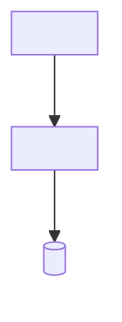

<!--
Reusable template adapted from Bertrand Florat's Architecture Document Template:
https://github.com/bflorat/architecture-document-template
Template adaptation licensed CC BY-SA 4.0:
https://creativecommons.org/licenses/by-sa/4.0/
Changes: condensed and converted to Markdown with evidence, NFR, ADR, risk,
traceability, and Ubiquitous Language structures.
No endorsement by the creator is implied; see the upstream source for the
original work, notices, history, and disclaimers.
-->

# {{PROJECT_NAME}} Technical Architecture

| Field | Value |
|---|---|
| Status | {{STATUS}} |
| Owner | {{OWNER}} |
| Updated | {{DATE}} |
| Source revision | {{SOURCE_REVISION}} |
| Template baseline | Florat `architecture-document-template` / {{MODEL_VERSION}} |

## 1. Summary and scope

`<State the outcome, system boundary, architecture style, top quality drivers, and top risks in 5–10 sentences.>`

**In scope**

- `<item>`

**Out of scope**

- `<item and owning document>`

| Stakeholder | Concern answered here |
|---|---|
| `<role>` | `<concern>` |

## 2. Context and target architecture

```mermaid
flowchart LR
  actor["<Actor>"] -->|"<interaction>"] system["{{PROJECT_NAME}}"]
  system -->|"<protocol>"] dependency["<External dependency>"]
```

`<Explain current state, target state, boundary, ownership, and important dependencies.>`

| Component | Responsibility | Runtime/deployable unit | Data owned | Interfaces | Owner |
|---|---|---|---|---|---|
| `<component>` | `<responsibility>` | `<runtime>` | `<data>` | `<contracts>` | `<owner>` |

## 3. Drivers, constraints, and assumptions

| ID | Type | Statement | Source/owner | Architectural impact | Status |
|---|---|---|---|---|---|
| CON-01 | Constraint | `<hard boundary>` | `<source>` | `<impact>` | `<met/gap/risk>` |
| ASM-01 | Assumption | `<assumption>` | `<owner>` | `<impact if false>` | `<validation/date>` |

## 4. Measurable quality requirements

| ID | Attribute | Testable scenario | Target/measure | Verification | Solution/ADR |
|---|---|---|---|---|---|
| NFR-XX-01 | `<quality>` | `<stimulus, environment, response>` | `<number and unit>` | `<test/metric/exercise>` | `<component/ADR>` |

## 5. Architecture views

For each view, preserve `constraint -> requirement -> solution -> verification`. Mark irrelevant topics `N/A — reason`.

### 5.1 Application

- **Constraints/requirements:** `<capabilities, actors, integration, data lifecycle, degraded modes>`
- **Solution:** `<modules, external systems, APIs/events/files, data ownership, critical flows>`
- **Verification/evidence:** `<schemas, tests, manifests, observed flow>`

| Interface/data flow | Producer → consumer | Contract/protocol | Failure/idempotency | Security | Volume/limit |
|---|---|---|---|---|---|
| `<flow>` | `<source → target>` | `<contract>` | `<behavior>` | `<control>` | `<rate/size>` |

### 5.2 Development

- **Constraints/requirements:** `<mandated stack, support, delivery, maintainability>`
- **Solution:** `<repositories, deployables, stack, patterns, configuration, testing, CI/CD, observability conventions>`
- **Verification/evidence:** `<build/test pipeline, quality gates, release evidence>`

### 5.3 Infrastructure

- **Constraints/requirements:** `<hosting, network, availability, RTO/RPO, cost>`
- **Solution:** `<compute, zones, persistence, messaging, deployment, backup/restore, monitoring, ownership>`
- **Verification/evidence:** `<rendered manifests, restore test, game day, dashboards>`



### 5.4 Security

- **Constraints/requirements:** `<classification, privacy, identity, access, audit, threat>`
- **Solution:** `<trust boundaries, AuthN/AuthZ, secrets, encryption, validation, monitoring, incident response>`
- **Verification/evidence:** `<threat model, policy, security tests, audit query>`

### 5.5 Sizing

- **Constraints/requirements:** `<workload, latency, throughput, storage, quotas, growth>`
- **Solution:** `<capacity, scaling triggers, min/max, state bottlenecks, headroom>`
- **Verification/evidence:** `<calculation, load test, capacity dashboard>`

| Workload/component | Baseline/peak/growth | Target | Capacity/limit | Scaling trigger/bounds | Evidence |
|---|---|---|---|---|---|
| `<item>` | `<values>` | `<measure>` | `<capacity>` | `<metric/min/max>` | `<test/source>` |

## 6. Decisions, risks, and transition

| ADR | Decision | Consequence | Status/link |
|---|---|---|---|
| ADR-001 | `<decision>` | `<trade-off>` | `<status/link>` |

| Risk/TBD | Impact | Mitigation/evidence needed | Owner | Due/status |
|---|---|---|---|---|
| RISK-01 | `<impact>` | `<action>` | `<owner>` | `<status>` |

| Transition step | Change | Compatibility/data | Exit evidence | Rollback/decommissioning |
|---|---|---|---|---|
| `<step>` | `<change>` | `<strategy>` | `<criteria>` | `<plan>` |

## 7. Traceability

| Driver/constraint | NFR | ADR/solution | Verification | Gap/risk |
|---|---|---|---|---|
| `<CON/DRV>` | `<NFR>` | `<ADR/component>` | `<test/evidence>` | `<RISK/TBD>` |

## 8. Ubiquitous Language

| Term | Precise meaning | Context | Allowed aliases | Avoid | Owner/status |
|---|---|---|---|---|---|
| `<term>` | `<meaning>` | `<context>` | `<aliases>` | `<ambiguous synonym>` | `<owner/status>` |

## 9. Evidence and references

| Claim | Status | Source | Verified |
|---|---|---|---|
| `<claim>` | `<observed/stated/assumed/proposed>` | `<path/line/URL/command>` | `<date/revision>` |

- `<linked requirements, ADRs, schemas, threat model, runbooks, test reports, standards>`
