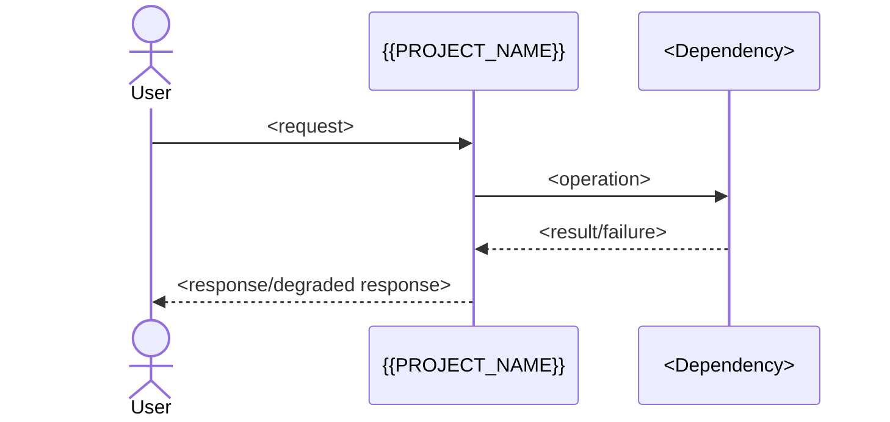
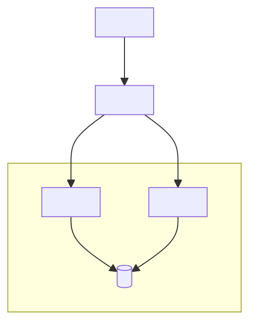

<!--
Reusable template adapted from Bertrand Florat's Architecture Document Template:
https://github.com/bflorat/architecture-document-template
Template adaptation licensed CC BY-SA 4.0:
https://creativecommons.org/licenses/by-sa/4.0/
Changes: converted to Markdown, reorganized for evidence/traceability, and added
NFR scenario, ADR, risk, transition, and validation structures.
No endorsement by the creator is implied; see the upstream source for the
original work, notices, history, and disclaimers.
This notice applies to the reusable template. Determine the license of the
project-specific document according to organizational policy.
-->

# {{PROJECT_NAME}} Technical Architecture Document

## Document control

| Field | Value |
|---|---|
| Status | {{STATUS}} |
| Owner | {{OWNER}} |
| Last updated | {{DATE}} |
| System/source revision | {{SOURCE_REVISION}} |
| Template baseline | Florat `architecture-document-template` / {{MODEL_VERSION}} |
| Review cadence | `<cadence or event trigger>` |
| Approvers | `<roles/names>` |
| Classification | `<public/internal/confidential>` |

### Revision history

| Version/date | Author | Change | Review/approval |
|---|---|---|---|
| {{DATE}} | {{OWNER}} | Initial architecture baseline | `<status>` |

### How to read this document

This document describes `<current state / transition state / target state>` for `<system boundary>`. `TBD` entries identify missing evidence and include an owner and due date. `N/A` entries explain considered topics that do not apply.

## 1. Executive summary

`<In one page or less: business outcome, system boundary, architecture style, major dependencies, top quality drivers, major decisions, and principal risks.>`

### 1.1 Architecture at a glance

| Concern | Summary |
|---|---|
| Business capability | `<what the system enables>` |
| Users/actors | `<primary actors>` |
| Architecture style | `<style and why>` |
| Runtime | `<where/how it runs>` |
| Data | `<primary information and ownership>` |
| Integration | `<critical external interfaces>` |
| Security | `<identity/trust summary>` |
| Availability/recovery | `<SLO, RTO, RPO>` |
| Scale | `<baseline, peak, growth>` |
| Delivery | `<deployment/release summary>` |
| Top risks | `<RISK IDs>` |

## 2. Purpose, audience, and scope

### 2.1 Purpose and decisions supported

- `<decision or activity this document supports>`

### 2.2 Audience

| Audience | Questions answered | Recommended sections |
|---|---|---|
| `<role>` | `<concerns>` | `<sections/views>` |

### 2.3 System boundary

**In scope**

- `<capability, module, data, environment, or lifecycle phase>`

**Out of scope / non-goals**

- `<item and rationale or owning document>`

### 2.4 Related documents

| Document | Purpose | Version/link | Authority/owner |
|---|---|---|---|
| `<requirement/ADR/threat model/runbook/standard>` | `<purpose>` | `<link>` | `<owner>` |

## 3. Stakeholders and concerns

| Stakeholder/role | Concern | Success evidence | Owner/contact |
|---|---|---|---|
| `<role>` | `<question or quality concern>` | `<decision/test/metric>` | `<owner>` |

## 4. Business and technical context

### 4.1 Objectives and outcomes

| Objective | Outcome measure | Deadline/horizon | Owner |
|---|---|---|---|
| `<objective>` | `<measure>` | `<date>` | `<owner>` |

### 4.2 Current state

`<Describe only facts needed to understand the target architecture and transition. Cite evidence.>`

### 4.3 Target state

`<Describe the desired architecture and how it changes the current state.>`

### 4.4 System context

```mermaid
flowchart LR
  actor["<Primary actor>"] -->|"<interaction>"] system["{{PROJECT_NAME}}"]
  system -->|"<protocol/contract>"] external["<External system>"]
```

Narrative: `<Explain the boundary, responsibilities, ownership, and critical dependencies.>`

### 4.5 External systems and dependencies

| System/dependency | Owner | Purpose | Interface/protocol | Criticality | Failure/degraded behavior | Evidence |
|---|---|---|---|---|---|---|
| `<name>` | `<owner>` | `<purpose>` | `<contract>` | `<level>` | `<behavior>` | `<source>` |

## 5. Drivers, principles, constraints, and uncertainty

### 5.1 Architecture drivers

| ID | Driver | Priority | Source/owner | Architectural impact |
|---|---|---|---|---|
| DRV-01 | `<driver>` | `<priority>` | `<source>` | `<impact>` |

### 5.2 Architecture principles

| ID | Principle | Rationale | Consequence/exception process |
|---|---|---|---|
| PRIN-01 | `<principle>` | `<why>` | `<consequence>` |

### 5.3 Constraints

| ID | Constraint | Type | Source | Impact | Addressed by | Status |
|---|---|---|---|---|---|---|
| CON-01 | `<hard boundary>` | `<legal/budget/time/technology/standard>` | `<source>` | `<impact>` | `<NFR/ADR/solution>` | `<met/gap/risk>` |

### 5.4 Assumptions

| ID | Assumption | Why needed | Validation/evidence | Owner | Due | Impact if false |
|---|---|---|---|---|---|---|
| ASM-01 | `<assumption>` | `<reason>` | `<test/source>` | `<owner>` | `<date>` | `<impact>` |

### 5.5 Unresolved points

| ID | Question | Why it matters | Evidence/decision needed | Owner | Due | Blocking? |
|---|---|---|---|---|---|---|
| TBD-01 | `<question>` | `<impact>` | `<needed>` | `<owner>` | `<date>` | `<yes/no>` |

## 6. Quality attributes and non-functional requirements

### 6.1 Quality priorities

| Quality attribute | Priority | Rationale | Trade-off |
|---|---|---|---|
| `<availability/security/performance/...>` | `<rank>` | `<reason>` | `<trade-off>` |

### 6.2 NFR scenarios

| ID | Attribute | Scenario (stimulus, environment, artifact, response) | Quantitative measure | Verification/evidence | Owner | Linked decision/solution |
|---|---|---|---|---|---|---|
| NFR-XX-01 | `<attribute>` | `<testable scenario>` | `<number and unit>` | `<test/dashboard/exercise>` | `<owner>` | `<ADR/component>` |

### 6.3 Service levels and recovery

| Service/operation | SLI | Objective | Window | RTO | RPO | Dependency ceiling | Evidence |
|---|---|---|---|---|---|---|---|
| `<service>` | `<indicator>` | `<target>` | `<window>` | `<time>` | `<time/data>` | `<limit>` | `<source>` |

## 7. Application view

### 7.1 Application constraints

- `<constraint or N/A — reason>`

### 7.2 Application requirements

- `<capability, interoperability, data lifecycle, degraded mode, retention, or concurrency requirement>`

### 7.3 Capabilities and modules

| Module/capability | Responsibility | Owner | Deployable unit | Data owned | Interfaces/events | Lifecycle/status |
|---|---|---|---|---|---|---|
| `<name>` | `<responsibility>` | `<owner>` | `<unit>` | `<data>` | `<contracts>` | `<current/target/retiring>` |

### 7.4 Module/container architecture

```mermaid
flowchart LR
  client["<Client/UI>"] -->|"<protocol>"] api["<API/module>"]
  api -->|"<query/command>"] store[("<Data store>")]
  api -->|"<event>"] bus[("<Event bus>")]
```

Narrative: `<Explain responsibilities, boundaries, coupling, ownership, and important architectural style.>`

### 7.5 Information and data ownership

| Data/domain object | System of record | Owner | Classification | Retention/purge | Consumers | Consistency |
|---|---|---|---|---|---|---|
| `<term>` | `<system>` | `<owner>` | `<class>` | `<policy>` | `<consumers>` | `<model>` |

### 7.6 Interfaces and flows

| ID | Producer | Consumer | Contract/protocol | Semantic purpose | AuthN/AuthZ | Delivery/error semantics | Volume/limit | Versioning |
|---|---|---|---|---|---|---|---|---|
| INT-01 | `<producer>` | `<consumer>` | `<API/event/file>` | `<purpose>` | `<method>` | `<retry/idempotency/DLQ>` | `<rate/size>` | `<policy>` |

### 7.7 Critical flow



### 7.8 Application transition and data migration

| Stage | Change | Coexistence/compatibility | Data migration | Exit criteria | Rollback |
|---|---|---|---|---|---|
| `<stage>` | `<change>` | `<strategy>` | `<method>` | `<measure>` | `<approach>` |

## 8. Development view

### 8.1 Development constraints and requirements

- `<mandated stack, support policy, delivery requirement, or N/A — reason>`

### 8.2 Code and deployable-unit organization

| Repository/path | Module/deployable unit | Responsibility | Build artifact | Runtime | Owner |
|---|---|---|---|---|---|
| `<path>` | `<unit>` | `<responsibility>` | `<artifact>` | `<runtime>` | `<owner>` |

### 8.3 Technology stack and dependencies

| Layer/use | Technology/version | Status/support horizon | Rationale | Alternatives/ADR | Update owner |
|---|---|---|---|---|---|
| `<use>` | `<technology>` | `<status>` | `<why>` | `<ADR>` | `<owner>` |

### 8.4 Architectural patterns and conventions

| Pattern/convention | Where used | Rationale | Guardrail/test | Exception |
|---|---|---|---|---|
| `<pattern>` | `<scope>` | `<why>` | `<enforcement>` | `<process>` |

Cover error handling, retries, idempotency, concurrency, transactions, time zones, encoding, pagination, configuration, feature flags, schema evolution, and logging when material.

### 8.5 Build, test, and delivery

| Stage | Tool/process | Inputs/outputs | Quality/security gate | Evidence | Failure/rollback |
|---|---|---|---|---|---|
| `<stage>` | `<tool>` | `<artifact>` | `<gate>` | `<link>` | `<behavior>` |

### 8.6 Test strategy

| Risk/quality | Test level/type | Environment/data | Frequency | Acceptance criterion | Owner |
|---|---|---|---|---|---|
| `<risk>` | `<unit/contract/e2e/load/resilience/security>` | `<setup>` | `<frequency>` | `<measure>` | `<owner>` |

### 8.7 Observability conventions

| Signal | Convention | Required context | Retention/access | Verification |
|---|---|---|---|---|
| Logs | `<structure/levels>` | `<correlation/domain IDs>` | `<policy>` | `<test>` |
| Metrics | `<naming/labels>` | `<golden/business signals>` | `<policy>` | `<dashboard>` |
| Traces | `<propagation/sampling>` | `<trace/baggage>` | `<policy>` | `<query>` |

## 9. Infrastructure view

### 9.1 Infrastructure constraints and requirements

- `<hosting/network/availability/deployment/cost/lifecycle constraint or N/A — reason>`

### 9.2 Production topology and deployment



Narrative: `<Explain failure domains, trust zones, ownership, routing, and state.>`

### 9.3 Runtime inventory

| Deployable unit | Runtime/compute | Min/max | Failure domain | State | Network exposure | Owner |
|---|---|---|---|---|---|---|
| `<unit>` | `<platform>` | `<replicas/capacity>` | `<domain>` | `<stateless/stateful>` | `<ingress/egress>` | `<owner>` |

### 9.4 Infrastructure services

| Service | Purpose | Tier/plan | HA/replication | Backup/restore | Limits/quotas | Owner |
|---|---|---|---|---|---|---|
| `<database/queue/cache/storage/...>` | `<purpose>` | `<tier>` | `<method>` | `<RPO/RTO/test>` | `<limits>` | `<owner>` |

### 9.5 Network and trust boundaries

| Flow | Source zone | Destination zone | Protocol/port | Authentication/encryption | Purpose | Control/evidence |
|---|---|---|---|---|---|---|
| `<flow>` | `<zone>` | `<zone>` | `<protocol>` | `<control>` | `<purpose>` | `<policy/manifest>` |

### 9.6 Deployment, upgrade, and rollback

`<Describe strategy, migration ordering, readiness, maintenance mode, rollback conditions, and client/server compatibility.>`

### 9.7 Availability, backup, and restore

| Failure/event | Detection | Automatic response | Manual action | Recovery target | Exercise/evidence |
|---|---|---|---|---|---|
| `<failure>` | `<signal>` | `<response>` | `<runbook>` | `<RTO/RPO>` | `<test>` |

### 9.8 Operations and observability

| Concern | Signal/dashboard | Alert/threshold | Runbook | Owner/escalation | Retention |
|---|---|---|---|---|---|
| `<availability/latency/errors/capacity/business>` | `<source>` | `<condition>` | `<link>` | `<owner>` | `<policy>` |

### 9.9 Cost, sustainability, and decommissioning

`<Describe cost drivers, budgets/alerts, idle/resource reduction, lifecycle constraints, ownership transfer, archival, and deletion.>`

## 10. Security view

### 10.1 Security constraints and requirements

- `<law/policy/threat/privacy/control requirement or N/A — reason>`

### 10.2 Assets and data classification

| Asset/data | Owner | Classification | Threat/impact | Residency/retention | Required controls |
|---|---|---|---|---|---|
| `<asset>` | `<owner>` | `<class>` | `<impact>` | `<policy>` | `<controls>` |

### 10.3 Trust boundaries and threat summary

`<Reference the diagram(s) showing where trust changes. Link the full threat model if separate.>`

| Threat/abuse case | Boundary/asset | Mitigation | Detection | Residual risk | Evidence/owner |
|---|---|---|---|---|---|
| `<threat>` | `<scope>` | `<control>` | `<signal>` | `<risk>` | `<test/source>` |

### 10.4 Identity, authentication, and authorization

| Actor/workload | Identity source | Authentication | Authorization model | Lifecycle/revocation | Audit |
|---|---|---|---|---|---|
| `<actor>` | `<IdP/workload identity>` | `<method>` | `<roles/policy/claims>` | `<process>` | `<events>` |

### 10.5 Secrets, keys, certificates, and encryption

| Material/data | Storage/manager | Provisioning/rotation | In-transit control | At-rest control | Owner/evidence |
|---|---|---|---|---|---|
| `<secret/key/data>` | `<manager>` | `<lifecycle>` | `<TLS/protocol>` | `<encryption/KMS>` | `<owner/source>` |

Do not record secret values, private keys, credentials, or exploitable endpoints.

### 10.6 Audit, privacy, and security operations

| Concern | Events/data | Protection/access | Retention | Monitoring/response | Verification |
|---|---|---|---|---|---|
| `<audit/privacy/vulnerability/incident>` | `<scope>` | `<control>` | `<period>` | `<process>` | `<evidence>` |

### 10.7 Supply-chain and delivery security

`<Describe dependency scanning, source/artifact provenance, signing, image scanning, secrets scanning, deployment authorization, and exception handling.>`

## 11. Sizing view

### 11.1 Sizing constraints and requirements

- `<budget/quota/latency/storage/growth constraint or N/A — reason>`

### 11.2 Workload model

| Workload/operation | Baseline | Peak/burst | Growth/horizon | Payload/data size | Concurrency | Source/confidence |
|---|---|---|---|---|---|---|
| `<operation>` | `<rate>` | `<rate>` | `<forecast>` | `<size>` | `<count>` | `<evidence>` |

### 11.3 Performance targets

| Operation | Percentile/measure | Target | Error budget/limit | Test method | Evidence |
|---|---|---|---|---|---|
| `<operation>` | `<p95/p99/throughput>` | `<number/unit>` | `<limit>` | `<test>` | `<result>` |

### 11.4 Capacity calculations

Show formulas, units, assumptions, headroom, and confidence.

```text
<resource need> = <workload> × <cost per unit> × <replication/overhead> × <headroom>
```

| Resource/dependency | Calculation | Required | Provisioned/limit | Headroom | Bottleneck/next action |
|---|---|---|---|---|---|
| `<CPU/memory/storage/network/connection/quota>` | `<formula>` | `<value>` | `<value>` | `<percent>` | `<risk/action>` |

### 11.5 Scaling behavior

| Component | Metric/trigger | Min | Max/ceiling | Scale behavior/cooldown | Stateful constraint | Verification |
|---|---|---|---|---|---|---|
| `<component>` | `<metric/threshold>` | `<value>` | `<value>` | `<behavior>` | `<constraint>` | `<load test/manifest>` |

### 11.6 Capacity validation plan/results

| Test/date | Environment/data fidelity | Scenario | Result | Target | Gap/action | Next date |
|---|---|---|---|---|---|---|
| `<test>` | `<fidelity>` | `<scenario>` | `<result>` | `<target>` | `<action>` | `<date>` |

## 12. Cross-view traceability and consistency

### 12.1 Traceability matrix

| Driver/constraint | Requirement/NFR | Decision/ADR | Solution components/views | Verification | Gap/risk |
|---|---|---|---|---|---|
| `<DRV/CON>` | `<NFR>` | `<ADR>` | `<components/sections>` | `<evidence>` | `<RISK/TBD>` |

### 12.2 Cross-view consistency checks

- [ ] Every deployable unit maps to an application/development component.
- [ ] Every external interface has ownership, security, failure, versioning, and capacity treatment where relevant.
- [ ] Every data store has ownership, classification, retention, recovery, and sizing.
- [ ] Every availability claim accounts for dependency ceilings and state.
- [ ] Every scaling rule has a metric, bounds, state behavior, and validation evidence.
- [ ] Current, transition, and target states are labeled consistently.
- [ ] Terms match the glossary across prose, diagrams, contracts, and code-facing names.

## 13. Decisions, risks, and transition governance

### 13.1 Architecture Decision Records

| ADR | Decision | Status/date | Consequence in this architecture | Link |
|---|---|---|---|---|
| ADR-001 | `<decision>` | `<status/date>` | `<impact>` | `<link>` |

### 13.2 Risks

| ID | Risk | Cause | Impact | Likelihood | Mitigation | Trigger/indicator | Owner | Status |
|---|---|---|---|---|---|---|---|---|
| RISK-01 | `<risk>` | `<cause>` | `<impact>` | `<level>` | `<mitigation>` | `<signal>` | `<owner>` | `<status>` |

### 13.3 Transition roadmap

| Milestone/state | Architecture change | Dependencies | Entry criteria | Exit/verification | Rollback/decommissioning |
|---|---|---|---|---|---|
| `<milestone>` | `<change>` | `<dependencies>` | `<criteria>` | `<evidence>` | `<plan>` |

## 14. Ubiquitous Language and glossary

Use these terms consistently in conversations, requirements, diagrams, interfaces, schemas, UI, and code-facing names. Treat terms as part of the domain model and evolve them through review with domain experts.

### 14.1 Terms under discussion

| Term | Candidate meaning | Ambiguity/question | Owner | Due/status |
|---|---|---|---|---|
| `<term>` | `<meaning>` | `<issue>` | `<owner>` | `<status>` |

### 14.2 Accepted terms

| Term | Precise meaning | Context | Allowed aliases | Avoid | Example | Owner/status |
|---|---|---|---|---|---|---|
| `<term>` | `<meaning>` | `<bounded context>` | `<aliases>` | `<ambiguous synonym>` | `<usage>` | `<owner/accepted>` |

## 15. Evidence ledger and references

### 15.1 Evidence ledger

| Claim | Status | Source/evidence | Owner | Verified | Confidence/notes |
|---|---|---|---|---|---|
| `<claim>` | `<observed/stated/assumed/proposed>` | `<path/line/URL/command>` | `<owner>` | `<date/revision>` | `<notes>` |

### 15.2 References

- `<authoritative document or link, version, access date>`

## 16. Appendices

Use appendices only for decision-useful specialist detail that would interrupt the main narrative. Link volatile inventories, detailed designs, runbooks, threat models, test reports, and environment-specific operations rather than copying them.
