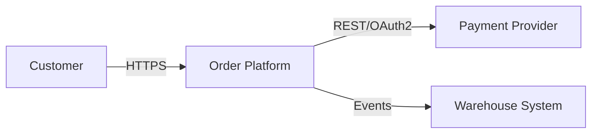
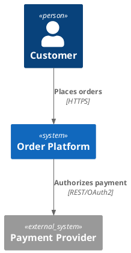

# Tooling and Evidence Guide

## Contents

1. [Tool-selection principles](#tool-selection-principles)
2. [Repository discovery](#repository-discovery)
3. [Evidence capture](#evidence-capture)
4. [External research](#external-research)
5. [Diagram tooling](#diagram-tooling)
6. [Markdown and AsciiDoc](#markdown-and-asciidoc)
7. [PDF and DOCX delivery](#pdf-and-docx-delivery)
8. [Local skill scripts](#local-skill-scripts)
9. [Automation and CI](#automation-and-ci)

## Tool-selection principles

Choose tools by the question being answered, not by habit.

| Question | Preferred evidence/tool |
|---|---|
| What components and call relationships exist? | Code knowledge graph or language-aware symbol/call tools |
| What exact value is deployed? | Rendered manifest, infrastructure plan, runtime configuration, or authoritative config file |
| What interfaces exist? | OpenAPI/AsyncAPI/Protobuf/schema files plus route/event discovery |
| How is the system built and released? | CI/CD definitions, build files, artifact metadata, deployment definitions |
| How does it behave under failure/load? | Tests, traces, dashboards, incidents, load-test results, SLOs |
| Why was a choice made? | Accepted ADR, decision log, meeting record, or responsible stakeholder |
| What does an external product/version support? | Current primary vendor documentation or standard |
| What do domain terms mean? | Domain experts, requirements, UI, contracts, data model, glossary |

Do not infer runtime topology from folder names alone. Do not present generated reports as current truth without checking their source revision.

## Repository discovery

Read workspace instructions such as `AGENTS.md` first. Honor required discovery tools and refresh/index requirements.

When a codebase knowledge graph is available:

1. Index or refresh the repository if required.
2. Use architecture summaries to identify modules and runtime seams.
3. Use graph search to locate entry points, handlers, services, repositories, jobs, routes, and events.
4. Trace inbound/outbound call paths for critical flows.
5. Read exact snippets only after resolving qualified names.
6. Use graph queries for cross-cutting inventories and consistency checks.
7. Fall back to literal/config search for non-code files, settings, protocols, error messages, and generated manifests.
8. Refresh the graph after material code/document changes when repository policy requires it.

When no graph exists:

- use language-server/reference tools when available;
- use `rg --files` for inventory and `rg` for precise strings;
- inspect build/module manifests before sampling implementation files;
- trace one representative end-to-end flow before generalizing;
- compare source with tests and deployment configuration.

Suggested evidence inventory:

```text
Repository instructions
Existing architecture docs and ADRs
Build/module/package manifests
Entrypoints and deployable units
API, event, and data schemas
Runtime configuration and feature flags
Containers, Kubernetes, Terraform/Bicep/CloudFormation
CI/CD and release definitions
Identity, policy, and secrets-injection configuration
Logging, metrics, tracing, dashboards, and alerts
Backup/restore and disaster-recovery procedures
Load/performance/resilience/security test artifacts
Ownership files, runbooks, incident/postmortem evidence
```

## Evidence capture

Keep a scratch evidence ledger while investigating. Use exact, reproducible references:

```markdown
| Claim | Status | Evidence | Verified |
|---|---|---|---|
| API runs with at least two replicas | observed | `deploy/overlays/prod/api.yaml`, rendered with `kubectl kustomize ...` | 2026-07-16 |
| RTO is 30 minutes | stated | `requirements/continuity.md#rto`, owner: Service Manager | 2026-07-14 |
| Queue partition count supports 2x peak | proposed | sizing calculation `CAP-03`; requires load test | TBD |
```

Prefer commands whose output can be regenerated. Record command, working directory, revision, relevant environment, and result summary. Avoid embedding secrets or full environment dumps.

For generated configuration, capture both the source overlay/module and the rendered result. For runtime checks, record whether the observation is a snapshot and when it expires.

## External research

Browse when facts may have changed or when a named page, standard, vendor capability, license, or current recommendation is involved.

Apply these rules:

- Prefer the technology vendor, standards body, maintained repository, or original author.
- Pin product/document versions and access date.
- Separate source statements from architectural inference.
- Link the exact supporting page near the claim.
- Respect source licenses and quotation limits; summarize rather than copying long passages.
- Do not use blogs as sole evidence for a security, compliance, or support claim when a primary source exists.

Use the Florat and Fowler source URLs recorded in `source-and-customizer-guide.md` for the practices bundled with this skill.

## Diagram tooling

Prefer text-native diagrams for living documents:

- **Mermaid:** readily embedded in Markdown and suitable for flowcharts, sequence diagrams, state diagrams, ER diagrams, timelines, and simple architecture views.
- **PlantUML:** strong for C4-PlantUML, deployment, component, sequence, and richer diagram reuse.
- **Structurizr DSL:** useful when C4 models require a consistent model with multiple generated views.
- **Graphviz/DOT:** useful for dependency graphs and automatically generated topology.

Use repository-standard tooling when it exists. Keep editable source beside rendered output. Verify the renderer used by the target Git host or documentation pipeline.

Mermaid system-context skeleton:

````markdown

````

PlantUML C4 skeleton:



Do not depend on remote diagram includes in restricted or reproducible builds without pinning/caching them.

## Markdown and AsciiDoc

Use Markdown by default when the repository already renders it and the document can remain coherent as one file. Use AsciiDoc when the source model, multi-file includes, advanced tables, cross-references, or existing publication toolchain justify it.

Markdown checks:

- preview using the target Git/documentation renderer;
- validate heading hierarchy, anchors, table width, internal links, and Mermaid blocks;
- keep one sentence around each table/diagram explaining its purpose.

AsciiDoc checks:

- install or containerize a pinned Asciidoctor toolchain;
- render the top-level and each linked view;
- validate `xref`, image, include, and anchor resolution;
- verify table and admonition rendering;
- set `allow-uri-read` only when required and approved;
- avoid unpinned remote includes.

Example local rendering commands, subject to the installed toolchain:

```bash
asciidoctor -a data-uri -a allow-uri-read README.adoc
asciidoctor-pdf README.adoc
```

The bundled upstream `export` script uses Docker. Read it before execution and adapt paths/images for the copied template.

## PDF and DOCX delivery

Treat Markdown/AsciiDoc as the maintainable source unless the user explicitly requires an office format as source.

For PDF:

- use a dedicated PDF creation/rendering capability when available;
- render every page to images or inspect with a PDF viewer;
- check clipped tables, small diagram labels, headings, orphan lines, footers, links, and page numbers.

For DOCX:

- use a dedicated document-generation capability when available;
- map headings, tables, captions, code, and diagrams to styles;
- inspect the produced document visually in a compatible renderer;
- preserve source links and revision metadata.

Never claim layout validation based only on successful file creation.

## Local skill scripts

### `create_tad.py`

Create a Markdown or AsciiDoc scaffold.

```bash
python scripts/create_tad.py --project "Payments Hub" --owner "Platform Architecture" --output docs/technical-architecture.md
python scripts/create_tad.py --project "Internal API" --profile lean --output docs/architecture.md
python scripts/create_tad.py --project "Case Management" --format asciidoc --output docs/architecture --source-revision c1787cd
```

Important options:

- `--profile detailed|lean` for Markdown.
- `--format markdown|asciidoc`.
- `--status`, `--owner`, and `--source-revision` replace template tokens.
- `--force` permits explicit overwrite.

### `validate_tad.py`

Perform deterministic structural checks.

```bash
python scripts/validate_tad.py docs/technical-architecture.md --profile standard
python scripts/validate_tad.py docs/architecture --profile strict --json
python scripts/validate_tad.py docs/technical-architecture.md --profile strict --fail-on-warnings
```

Profiles:

- `lean`: checks the minimum architecture spine.
- `standard`: checks the five views, glossary, NFRs, decisions/risks, diagrams, and traceability.
- `strict`: raises depth expectations and treats missing measurable evidence as more severe.

The validator is a guardrail, not a substitute for architecture review. Read every warning in context.

## Automation and CI

Add low-cost document checks to CI when the TAD is governed as code:

1. Run `validate_tad.py --json` and archive its report.
2. Render Markdown/AsciiDoc using the same engine used for publication.
3. Compile Mermaid/PlantUML and fail on syntax errors.
4. Run link and anchor checking.
5. Scan generated output for secrets and sensitive infrastructure values.
6. Check that linked ADRs and evidence paths exist.
7. Optionally require review from architecture, security, and operations owners when their sections change.

Keep CI deterministic: pin container/tool versions, avoid mutable remote includes, and distinguish warnings from hard failures deliberately.
